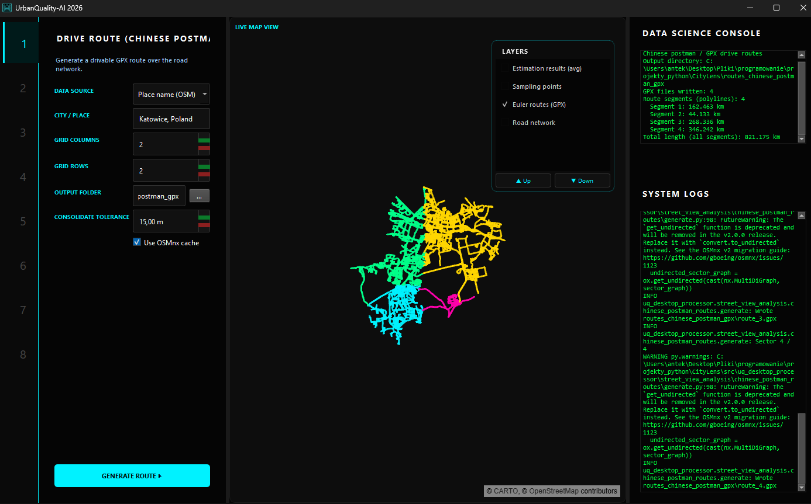
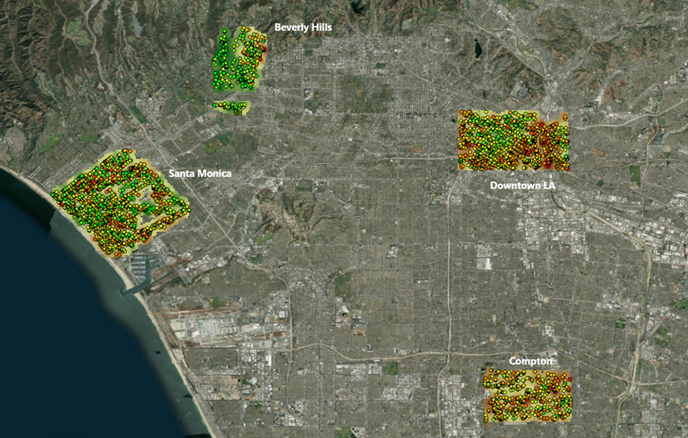

# UrbanQuality AI: Automated Urban Space Quality Mapping

An end-to-end system for the objective, quantitative visual assessment of urban fabric, integrating Computer Vision (DINOv2), Geographic Information Systems (GIS), and advanced spatial data analytics.

---

## 📌 About the Project

This project provides a suite of tools for data-driven identification of areas requiring revitalization. Utilizing the DINOv2 model (Vision Transformer architecture) and a dedicated data pipeline, the system analyzes spherical (360°) images and evaluates the environment across six psycho-social categories:

- Safer  
- Wealthier  
- More Beautiful  
- Livelier  
- Less Depressing  
- Less Boring  

The system eliminates subjectivity in urban planning by offering measurable indicators of spatial quality for urbanized areas, with a particular focus on post-industrial sites.

---

## 🏗️ Tool Ecosystem

The project is built on a modular ecosystem consisting of:

### ⚙️ [UQ Training Engine](../uq-training-engine)
The training and optimization engine. It is responsible for training AI models in a ViT multi-head architecture. It utilizes TrueSkill rankings to stabilize learning on preferential labels and the Optuna library for automated hyperparameter tuning.

### 🖥️ [UQ Desktop Processor](../uq-desktop-processor)
A desktop application (GUI) and processing library used for the operational deployment of trained models. It includes modules for:

- Route planning  
- Mass inference on 360° images  
- Exporting results to geoinformation formats (GeoJSON, GPKG, SHP)

---

## 🚀 Project Workflow

The standard workflow within the system:

1. **Model Fine-tuning**  
   Training the DINOv2 architecture with multiple regression heads tailored to urban perception.

2. **Route Optimization**  
   Determining the optimal driving path using the Chinese Postman Problem algorithm based on road graphs from OpenStreetMap.

3. **Data Acquisition**  
   Capturing 360° spherical photos in the field or mass-downloading street-level data from the Mapillary platform.

4. **Processing and Export**  
   Automated extraction of planar projections, mass visual evaluation by AI, and generation of GPS-integrated vector layers.

---

## 💡 Model Universality

By leveraging the global Place Pulse 2.0 dataset, the model is universal. The system can be applied to analyze any urban fabric (not just post-mining or post-industrial areas), regardless of geographic location or architectural specifics.

---

## 🛠️ Tech Stack

### Artificial Intelligence
- Python  
- PyTorch  
- DINOv2 (ViT)  
- OpenAI CLIP  
- Optuna  
- Timm  

### Geoinformatics
- GeoPandas  
- OSMnx  
- Shapely  
- Pyogrio  
- Fiona  

### Data Science
- Pandas  
- NumPy  
- Scikit-learn  
- TrueSkill  

### Software Engineering
- PySide6 (Qt)  
- Poetry  
- MkDocs  
- GitHub Actions (CI/CD)  

---

## 📈 Research Aspect

The primary research objective of the project is to optimize the model training process for adaptation to specific, degraded urban environments. The system enables precise, automated diagnosis of spatial issues, providing data-driven directions for future revitalization processes.

---

## 📸 Screenshots

### GUI Processor Interface
A desktop application for managing the data processing pipeline, from route planning to AI inference.

  

---

### Spatial Analysis Result
Visualization of the resulting layer using Los Angeles as an example (Mapillary data). The analysis confirms the model's ability to distinguish the urban characteristics of different neighborhoods:

  

* **Clearly identifies** areas of high visual quality (e.g., Beverly Hills)  
* **Highlights** regions with lower quality ratings (e.g., Compton)  
* **Reflects** the diverse characteristics of areas such as Santa Monica and dynamically changing Downtown

---

  

